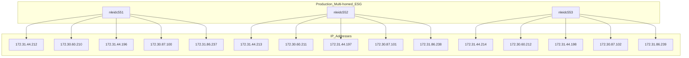

# Production Multi-homed hosts

```mermaid
graph TD
  subgraph Production_Multi-homed_ESG
    nleidc551["nleidc551"]
    nleidc552["nleidc552"]
    nleidc553["nleidc553"]
  end

  subgraph IP_Addresses
    ip1["172.31.44.212"]
    ip2["172.30.60.210"]
    ip3["172.31.44.196"]
    ip4["172.30.87.100"]
    ip5["172.31.86.237"]
    ip6["172.31.44.213"]
    ip7["172.30.60.211"]
    ip8["172.31.44.197"]
    ip9["172.30.87.101"]
    ip10["172.31.86.238"]
    ip11["172.31.44.214"]
    ip12["172.30.60.212"]
    ip13["172.31.44.198"]
    ip14["172.30.87.102"]
    ip15["172.31.86.239"]
  end

  nleidc551 --> ip1
  nleidc551 --> ip2
  nleidc551 --> ip3
  nleidc551 --> ip4
  nleidc551 --> ip5

  nleidc552 --> ip6
  nleidc552 --> ip7
  nleidc552 --> ip8
  nleidc552 --> ip9
  nleidc552 --> ip10

  nleidc553 --> ip11
  nleidc553 --> ip12
  nleidc553 --> ip13
  nleidc553 --> ip14
  nleidc553 --> ip15
```
